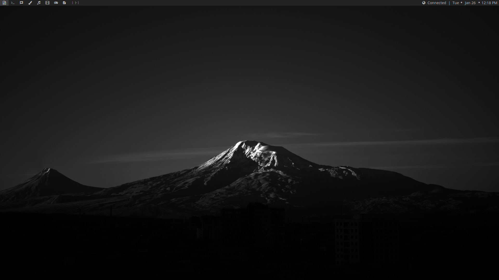
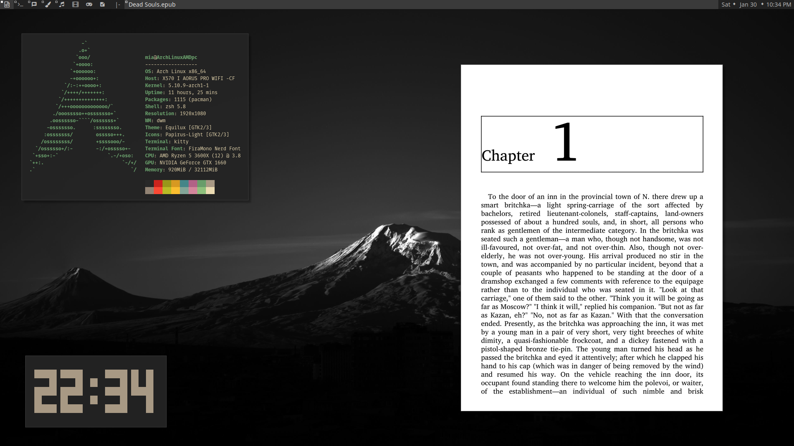
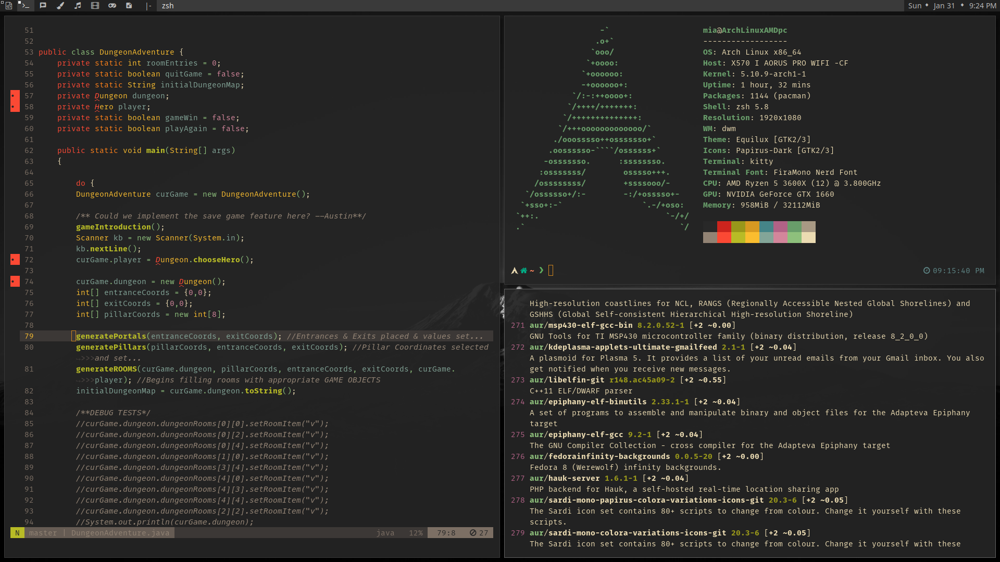

dwm - dynamic window manager
============================
dwm is an extremely fast, small, and dynamic window manager for X. 
This is my personal rice of suckless dwm using a grayscale color theme.

Screenshots
----------

Key Mappings
------------
| Action                        | `ModKey` = `Super/Windows` |
|-------------------------------|----------------------------|
| Key Bindings List | `ModKey` + `ALT` + `s` |
| Terminal | `ModKey` + `ENTER` |
| Tabbed Terminal | `ModKey` + `CONTROL` + `ENTER` |
| Brave browser | `ModKey` + `ALT` + `SPACE` |
| Rofi app launcher | `ALT` + `SPACE` |
| Dmenu app launcher | `ModKey` + `p` |
| Shift view tag left | `ModKey` + `ALT` + `l` |
| Shift view tag right | `ModKey` + `ALT` + `h` |
| Move window to master position | `ModKey` + `SHIFT` + `ENTER` |
| Move window up in stack | `ModKey` + `SHIFT` + `k` |
| Move window down in stack | `ModKey` + `SHIFT` + `j` |
| Focus window up in stack | `ModKey` + `k` |
| Focus window down in stack | `ModKey` + `j` |
| Full screenshot | `PRINT SCREEN` |
| Current window screenshot | `ModKey` + `PRINT SCREEN` |
| Selection screenshot | `ModKey` + `SHIFT` + `PRINT SCREEN` |
| Increase gap | `ModKey` + `=` |
| Decrease gap | `ModKey` + `-` |
| No gap | `ModKey` + `SHIFT` + `-` |
| Logout | `CONTROL` + `SHIFT` + `ESCAPE` |
| Power Menu | `ModKey` + `SHIFT` + `ESCAPE` |

Applied Patches
---------------
- [actualfullscreen-20191112-cb3f58a.diff](./patches/dwm-actualfullscreen-20191112-cb3f58a.diff)
- [alpha-20201019-61bb8b2.diff](./patches/dwm-alpha-20201019-61bb8b2.diff)
- [alwayscenter-20200625-f04cac6.diff](./patches/dwm-alwayscenter-20200625-f04cac6.diff)
- [autoresize-6.1.diff](./patches/dwm-autoresize-6.1.diff)
- [awesomebar-20200907-6.2.diff](./patches/dwm-awesomebar-20200907-6.2.diff)
- [center-6.2.diff](./patches/dwm-center-6.2.diff)
- [cyclelayouts-20180524-6.2.diff](./patches/dwm-cyclelayouts-20180524-6.2.diff)
- [fixborders-6.2.diff](./patches/dwm-fixborders-6.2.diff)
- [focusonnetactive-6.2.diff](./patches/dwm-focusonnetactive-6.2.diff)
- [fullgaps-6.2.diff](./patches/dwm-fullgaps-6.2.diff)
- [gapgrid-6.2.diff](./patches/dwm-gapgrid-6.2.diff)
- movestack
- [pertag-20200914-61bb8b2.diff](./patches/dwm-pertag-20200914-61bb8b2.diff)
- [resizecorners-6.2.diff](./patches/dwm-resizecorners-6.2.diff)
- shiftview
- [switchtotag-6.2.diff](./patches/dwm-switchtotag-6.2.diff)
- [systray-20210418-67d76bd.diff](./patches/dwm-systray-20210418-67d76bd.diff)
- [warp-6.2.diff](./patches/dwm-warp-6.2.diff)

Requirements
------------
In order to build dwm, you need the Xlib header files.
- **Terminal** - alacritty 
   You can change the default terminal command (termcmd) in the [config.def.h](./config.def.h).
- **Fonts** - [Noto Sans Nerd Font Regular](https://github.com/ryanoasis/nerd-fonts/blob/master/patched-fonts/Noto/Sans/complete/Noto%20Sans%20Regular%20Nerd%20Font%20Complete.ttf)
- **Scripts** 
    **Screenshots** - Use my [screenshot scripts](https://github.com/kaykay38/dotfiles/tree/main/.config/.system) from my [dotfiles](https://github.com/kaykay38/dotfiles) ([scrot](https://github.com/resurrecting-open-source-projects/scrot) and [xclip](https://github.com/astrand/xclip) are needed for scripts to work).

    **Power Menu** - Use my [power menu script](https://github.com/kaykay38/dotfiles/tree/main/.config/.system/sysmenu) from my [dotfiles](https://github.com/kaykay38/dotfiles) ([rofi](https://github.com/davatorium/rofi) is needed for script to work).
    **Key Bindings List** - bat

Installation
------------
Edit config.mk to match your local setup (dwm is installed into
the /usr/local namespace by default).

Afterwards enter the following command to build and install dwm (if
necessary as root):

    make clean install

Running dwm
-----------
Add the following line to your .xinitrc to start dwm using startx:

    exec dwm

In order to connect dwm to a specific display, make sure that
the DISPLAY environment variable is set correctly, e.g.:

    DISPLAY=foo.bar:1 exec dwm

(This will start dwm on display :1 of the host foo.bar.)

In order to display status info in the bar, you can do something
like this in your .xinitrc:

    while xsetroot -name "`date` `uptime | sed 's/.*,//'`"
    do
    	sleep 1
    done &
    exec dwm

Configuration
-------------
The configuration of dwm is done by editing the [config.def.h](./config.def.h),
and (re)compiling the source code.
